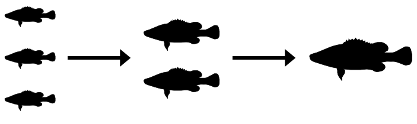

### trophic is an R package to estimate trophic energy flows and carrying capacities from partial or complete food webs 

trophic lets you simulate energy flows through a partial or complete food web. Known energy flows can be linked to biomass and abundance estimates at any given trophic level.

### See the [website](https://jdyen.github.io/trophic/) for more information, [tutorials](https://jdyen.github.io/trophic/get_started.html), [examples](https://jdyen.github.io/trophic/example_models.html), and [package documentation](https://jdyen.github.io/trophic/reference-index.html).

You can install the package directly from GitHub using the devtools package:

``` r
devtools::install_github("jdyen/trophic")
```

Please leave feedback, bug reports or feature requests at the GitHub [issues page](https://github.com/jdyen/trophic/issues). 

[](https://travis-ci.org/jdyen/trophic) [](https://codecov.io/github/jdyen/trophic?branch=master) [](https://opensource.org/licenses/Apache-2.0)
 
